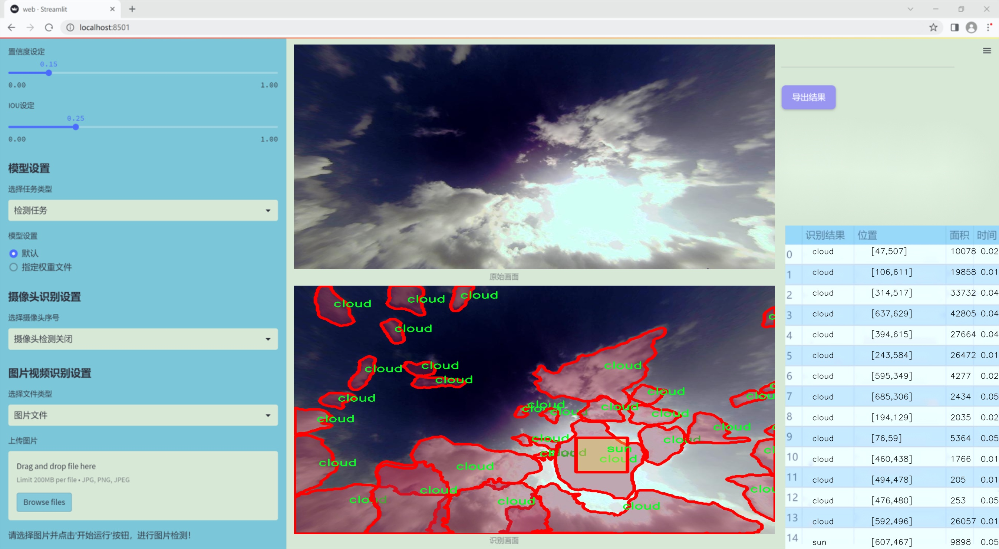

### 1.背景意义

### 研究背景与意义

随着全球气候变化的加剧，云层和太阳辐射的监测变得愈发重要。云层的变化不仅影响天气预报，还对太阳能发电的效率产生直接影响。因此，开发一个高效、准确的云与太阳检测系统具有重要的实际意义。传统的云检测方法往往依赖于人工观察或简单的图像处理技术，难以满足实时监测和高精度要求。而深度学习技术的快速发展为解决这一问题提供了新的思路。

YOLO（You Only Look Once）系列模型以其快速和高效的目标检测能力而受到广泛关注。YOLOv11作为该系列的最新版本，结合了先进的卷积神经网络架构，能够在保持高精度的同时实现实时检测。通过对YOLOv11的改进，我们可以更好地适应云与太阳的检测需求，尤其是在复杂的气象条件下。

本研究所使用的数据集“Cloud Master 1.1”包含1200张图像，涵盖了“云”和“太阳”两个类别。这一数据集经过精心标注和预处理，能够为模型的训练提供高质量的输入。数据集的丰富性和多样性使得模型能够学习到不同天气条件下的云层特征，从而提高检测的鲁棒性和准确性。

此外，随着云计算和大数据技术的发展，基于云平台的计算机视觉系统可以实现更高效的数据处理和模型训练。通过将改进的YOLOv11模型与云计算相结合，我们不仅能够实现对云层和太阳的实时监测，还能够为气象研究、环境保护以及可再生能源的利用提供有力支持。

综上所述，基于改进YOLOv11的云与太阳检测系统的研究，不仅具有重要的学术价值，也在实际应用中展现出广阔的前景。通过这一研究，我们希望能够推动计算机视觉技术在气象监测领域的应用，为应对气候变化和推动可持续发展贡献力量。

### 2.视频效果

[2.1 视频效果](https://www.bilibili.com/video/BV13fq3YXERc/)

### 3.图片效果




##### [项目涉及的源码数据来源链接](https://kdocs.cn/l/cszuIiCKVNis)**

注意：本项目提供训练的数据集和训练教程,由于版本持续更新,暂不提供权重文件（best.pt）,请按照6.训练教程进行训练后实现上图演示的效果。

### 4.数据集信息

##### 4.1 本项目数据集类别数＆类别名

nc: 2
names: ['cloud', 'sun']


该项目为【图像分割】数据集，请在【训练教程和Web端加载模型教程（第三步）】这一步的时候按照【图像分割】部分的教程来训练

##### 4.2 本项目数据集信息介绍

本项目数据集信息介绍

本项目所使用的数据集名为“Cloud Master 1.1”，旨在为改进YOLOv11的云与太阳检测系统提供高质量的训练数据。该数据集专注于两大类目标的识别与分类，具体包括“cloud”（云）和“sun”（太阳），共计包含2个类别。这一数据集的构建旨在提高计算机视觉模型在复杂气象条件下的检测精度，尤其是在多变的天空环境中，云层和太阳的变化对光照和天气预测有着重要影响。

“Cloud Master 1.1”数据集汇集了来自不同气候条件和地理位置的图像，确保了数据的多样性和代表性。数据集中包含的图像不仅涵盖了晴天、阴天、雨天等多种天气情况，还考虑了不同时间段的光照变化，如日出、正午和日落时分。这种多样化的样本选择为模型的训练提供了丰富的背景信息，使其能够在实际应用中更好地适应不同的环境。

此外，数据集中的每一张图像都经过精确标注，确保“cloud”和“sun”这两类目标的边界框清晰可辨。这种高质量的标注不仅提升了模型的学习效率，也为后续的模型评估提供了可靠的基准。通过对“Cloud Master 1.1”数据集的深入分析与训练，期望能够显著提升YOLOv11在云与太阳检测任务中的性能，使其在实时监测和气象分析等领域发挥更大的作用。整体而言，本项目的数据集为实现高效、准确的云与太阳检测系统奠定了坚实的基础。


### 5.全套项目环境部署视频教程（零基础手把手教学）

[5.1 所需软件PyCharm和Anaconda安装教程（第一步）](https://www.bilibili.com/video/BV1BoC1YCEKi/?spm_id_from=333.999.0.0&vd_source=bc9aec86d164b67a7004b996143742dc)


[5.2 安装Python虚拟环境创建和依赖库安装视频教程（第二步）](https://www.bilibili.com/video/BV1ZoC1YCEBw?spm_id_from=333.788.videopod.sections&vd_source=bc9aec86d164b67a7004b996143742dc)

### 6.改进YOLOv11训练教程和Web_UI前端加载模型教程（零基础手把手教学）

[6.1 改进YOLOv11训练教程和Web_UI前端加载模型教程（第三步）](https://www.bilibili.com/video/BV1BoC1YCEhR?spm_id_from=333.788.videopod.sections&vd_source=bc9aec86d164b67a7004b996143742dc)


按照上面的训练视频教程链接加载项目提供的数据集，运行train.py即可开始训练



     Epoch   gpu_mem       box       obj       cls    labels  img_size
     1/200     20.8G   0.01576   0.01955  0.007536        22      1280: 100%|██████████| 849/849 [14:42<00:00,  1.04s/it]
               Class     Images     Labels          P          R     mAP@.5 mAP@.5:.95: 100%|██████████| 213/213 [01:14<00:00,  2.87it/s]
                 all       3395      17314      0.994      0.957      0.0957      0.0843

     Epoch   gpu_mem       box       obj       cls    labels  img_size
     2/200     20.8G   0.01578   0.01923  0.007006        22      1280: 100%|██████████| 849/849 [14:44<00:00,  1.04s/it]
               Class     Images     Labels          P          R     mAP@.5 mAP@.5:.95: 100%|██████████| 213/213 [01:12<00:00,  2.95it/s]
                 all       3395      17314      0.996      0.956      0.0957      0.0845

     Epoch   gpu_mem       box       obj       cls    labels  img_size
     3/200     20.8G   0.01561    0.0191  0.006895        27      1280: 100%|██████████| 849/849 [10:56<00:00,  1.29it/s]
               Class     Images     Labels          P          R     mAP@.5 mAP@.5:.95: 100%|███████   | 187/213 [00:52<00:00,  4.04it/s]
                 all       3395      17314      0.996      0.957      0.0957      0.0845


###### [项目数据集下载链接](https://kdocs.cn/l/cszuIiCKVNis)

### 7.原始YOLOv11算法讲解


##### YOLOv11三大损失函数

YOLOv11（You Only Look Once）是一种流行的目标检测算法，其损失函数设计用于同时优化分类和定位任务。YOLO的损失函数通常包括几个部分：
**分类损失、定位损失（边界框回归损失）和置信度损失** 。其中，

  1. box_loss（边界框回归损失）是用于优化预测边界框与真实边界框之间的差异的部分。

  2. cls_loss（分类损失）是用于优化模型对目标类别的预测准确性的部分。分类损失确保模型能够正确地识别出图像中的对象属于哪个类别。

  3. dfl_loss（Distribution Focal Loss）是YOLO系列中的一种损失函数，特别是在一些改进版本如YOLOv5和YOLOv7中被引入。它的主要目的是解决目标检测中的类别不平衡问题，并提高模型在处理小目标和困难样本时的性能。

##### 边界框回归损失详解

box_loss（边界框回归损失）是用于优化预测边界框与真实边界框之间的差异的部分。


##### box_loss 的具体意义


##### 为什么需要 box_loss

  * 精确定位：通过最小化中心点坐标损失和宽高损失，模型能够更准确地预测目标的位置和大小。
  * 平衡不同类型的目标：使用平方根来处理宽高损失，可以更好地平衡不同大小的目标，确保小目标也能得到足够的关注。
  * 稳定训练：适当的损失函数设计有助于模型的稳定训练，避免梯度爆炸或消失等问题。

##### 分类损失详解

在YOLO（You Only Look
Once）目标检测算法中，cls_loss（分类损失）是用于优化模型对目标类别的预测准确性的部分。分类损失确保模型能够正确地识别出图像中的对象属于哪个类别。下面是关于cls_loss的详细解读：

##### 分类损失 (cls_loss) 的具体意义

  
分类损失通常使用交叉熵损失（Cross-Entropy
Loss）来计算。交叉熵损失衡量的是模型预测的概率分布与真实标签之间的差异。在YOLO中，分类损失的具体形式如下：


##### 为什么需要 cls_loss

  * 类别识别：cls_loss 确保模型能够正确识别出图像中的目标属于哪个类别。这对于目标检测任务至关重要，因为不仅需要知道目标的位置，还需要知道目标的类型。

  * 多类别支持：通过最小化分类损失，模型可以处理多个类别的目标检测任务。例如，在道路缺陷检测中，可能需要识别裂缝、坑洞、路面破损等多种类型的缺陷。

  * 提高准确性：分类损失有助于提高模型的分类准确性，从而提升整体检测性能。通过优化分类损失，模型可以更好地学习不同类别之间的特征差异。

##### 分布损失详解

`dfl_loss`（Distribution Focal
Loss）是YOLO系列中的一种损失函数，特别是在一些改进版本如YOLOv5和YOLOv7中被引入。它的主要目的是解决目标检测中的类别不平衡问题，并提高模型在处理小目标和困难样本时的性能。下面是对`dfl_loss`的详细解读：

##### DFL Loss 的背景

在目标检测任务中，类别不平衡是一个常见的问题。某些类别的样本数量可能远远多于其他类别，这会导致模型在训练过程中对常见类别的学习效果较好，而对罕见类别的学习效果较差。此外，小目标和困难样本的检测也是一个挑战，因为这些目标通常具有较少的特征信息，容易被忽略或误分类。

为了应对这些问题，研究者们提出了多种改进方法，其中之一就是`dfl_loss`。`dfl_loss`通过引入分布焦点损失来增强模型对困难样本的关注，并改善类别不平衡问题。

##### DFL Loss 的定义

DFL Loss
通常与传统的交叉熵损失结合使用，以增强模型对困难样本的学习能力。其核心思想是通过对每个类别的预测概率进行加权，使得模型更加关注那些难以正确分类的样本。

DFL Loss 的公式可以表示为：


##### DFL Loss 的具体意义**

  * **类别不平衡：** 通过引入平衡因子 α，DFL Loss 可以更好地处理类别不平衡问题。对于少数类别的样本，可以通过增加其权重来提升其重要性，从而提高模型对这些类别的检测性能。
  *  **困难样本：** 通过聚焦参数 γ，DFL Loss 可以让模型更加关注那些难以正确分类的样本。当 
  * γ 较大时，模型会对那些预测概率较低的样本给予更多的关注，从而提高这些样本的分类准确性。
  *  **提高整体性能** ：DFL Loss 结合了传统交叉熵损失的优势，并通过加权机制增强了模型对困难样本的学习能力，从而提高了整体的检测性能。


### 8.200+种全套改进YOLOV11创新点原理讲解

#### 8.1 200+种全套改进YOLOV11创新点原理讲解大全

由于篇幅限制，每个创新点的具体原理讲解就不全部展开，具体见下列网址中的改进模块对应项目的技术原理博客网址【Blog】（创新点均为模块化搭建，原理适配YOLOv5~YOLOv11等各种版本）

[改进模块技术原理博客【Blog】网址链接](https://gitee.com/qunmasj/good)


#### 8.2 精选部分改进YOLOV11创新点原理讲解

###### 这里节选部分改进创新点展开原理讲解(完整的改进原理见上图和[改进模块技术原理博客链接](https://gitee.com/qunmasj/good)【如果此小节的图加载失败可以通过CSDN或者Github搜索该博客的标题访问原始博客，原始博客图片显示正常】


### 空间和通道重建卷积SCConv
参考该博客提出的一种高效的卷积模块，称为SCConv (spatial and channel reconstruction convolution)，以减少冗余计算并促进代表性特征的学习。提出的SCConv由空间重构单元(SRU)和信道重构单元(CRU)两个单元组成。

（1）SRU根据权重分离冗余特征并进行重构，以抑制空间维度上的冗余，增强特征的表征。

（2）CRU采用分裂变换和融合策略来减少信道维度的冗余以及计算成本和存储。

（3）SCConv是一种即插即用的架构单元，可直接用于替代各种卷积神经网络中的标准卷积。实验结果表明，scconvo嵌入模型能够通过减少冗余特征来获得更好的性能，并且显著降低了复杂度和计算成本。


SCConv如图所示，它由两个单元组成，空间重建单元(SRU)和通道重建单元(CRU)，以顺序的方式放置。具体而言，对于瓶颈残差块中的中间输入特征X，首先通过SRU运算获得空间细化特征Xw，然后利用CRU运算获得信道细化特征Y。SCConv模块充分利用了特征之间的空间冗余和通道冗余，可以无缝集成到任何CNN架构中，以减少中间特征映射之间的冗余并增强CNN的特征表示。

#### SRU单元用于空间冗余


为了利用特征的空间冗余，引入了空间重构单元(SRU)，如图2所示，它利用了分离和重构操作。

分离操作 的目的是将信息丰富的特征图与空间内容对应的信息较少的特征图分离开来。我们利用组归一化(GN)层中的比例因子来评估不同特征图的信息内容。具体来说，给定一个中间特征映射X∈R N×C×H×W，首先通过减去平均值µ并除以标准差σ来标准化输入特征X，如下所示:


其中µ和σ是X的均值和标准差，ε是为了除法稳定性而加入的一个小的正常数，γ和β是可训练的仿射变换。

GN层中的可训练参数\gamma \in R^{C}用于测量每个批次和通道的空间像素方差。更丰富的空间信息反映了空间像素的更多变化，从而导致更大的γ。归一化相关权重W_{\gamma} \in R^{C}由下面公式2得到，表示不同特征映射的重要性。


然后将经Wγ重新加权的特征映射的权值通过sigmoid函数映射到(0,1)范围，并通过阈值进行门控。我们将阈值以上的权重设置为1，得到信息权重W1，将其设置为0，得到非信息权重W2(实验中阈值设置为0.5)。获取W的整个过程可以用公式表示。


最后将输入特征X分别乘以W1和W2，得到两个加权特征:信息量较大的特征X_{1}^{\omega }和信息量较小的特征X_{2}^{\omega }。这样就成功地将输入特征分为两部分:X_{1}^{\omega }具有信息量和表达性的空间内容，而X_{2}^{\omega }几乎没有信息，被认为是冗余的。

重构操作 将信息丰富的特征与信息较少的特征相加，生成信息更丰富的特征，从而节省空间空间。采用交叉重构运算，将加权后的两个不同的信息特征充分结合起来，加强它们之间的信息流。然后将交叉重构的特征X^{\omega1}和X^{\omega2}进行拼接，得到空间精细特征映射X^{\omega}。从后过程表示如下：


其中⊗是逐元素的乘法，⊕是逐元素的求和，∪是串联。将SRU应用于中间输入特征X后，不仅将信息特征与信息较少的特征分离，而且对其进行重构，增强代表性特征，抑制空间维度上的冗余特征。然而，空间精细特征映射X^{\omega}在通道维度上仍然是冗余的。

#### CRU单元用于通道冗余


分割 操作将输入的空间细化特征X^{\omega}分割成两个部分，一部分通道数是\alpha C，另一部分通道数是(1-\alpha) C，随后对两组特征的通道数使用1 * 1卷积核进行压缩，分别得到X_{up}和X_{low}。

转换 操作将输入的X_{up}作为“富特征提取”的输入，分别进行GWC和PWC，然后相加得到输出Y1，将输入X_{low}作为“富特征提取”的补充，进行PWC，得到的记过和原来的输入取并集得到Y2。

融合 操作使用简化的SKNet方法来自适应合并Y1和Y2。具体说是首先使用全局平均池化将全局空间信息和通道统计信息结合起来，得到经过池化的S1和S2。然后对S1和S2做Softmax得到特征权重向量\beta _{1}和\beta _{2}，最后使用特征权重向量得到输出Y = \beta _{1}*Y_{1} + \beta _{2}*Y_{2}，Y即为通道提炼的特征。


### 9.系统功能展示

图9.1.系统支持检测结果表格显示

  图9.2.系统支持置信度和IOU阈值手动调节

  图9.3.系统支持自定义加载权重文件best.pt(需要你通过步骤5中训练获得)

  图9.4.系统支持摄像头实时识别

  图9.5.系统支持图片识别

  图9.6.系统支持视频识别

  图9.7.系统支持识别结果文件自动保存

  图9.8.系统支持Excel导出检测结果数据


### 10. YOLOv11核心改进源码讲解

#### 10.1 kacn_conv.py

以下是对代码的核心部分进行提炼和详细注释的结果：

```python
import torch
import torch.nn as nn

class KACNConvNDLayer(nn.Module):
    def __init__(self, conv_class, norm_class, input_dim, output_dim, degree, kernel_size,
                 groups=1, padding=0, stride=1, dilation=1,
                 ndim: int = 2, dropout=0.0):
        super(KACNConvNDLayer, self).__init__()
        
        # 初始化参数
        self.inputdim = input_dim  # 输入维度
        self.outdim = output_dim    # 输出维度
        self.degree = degree         # 多项式的度数
        self.kernel_size = kernel_size  # 卷积核大小
        self.padding = padding       # 填充
        self.stride = stride         # 步幅
        self.dilation = dilation     # 膨胀
        self.groups = groups         # 分组卷积的组数
        self.ndim = ndim             # 数据的维度（1D, 2D, 3D）
        self.dropout = None          # Dropout层初始化为None

        # 初始化Dropout层
        if dropout > 0:
            if ndim == 1:
                self.dropout = nn.Dropout1d(p=dropout)
            elif ndim == 2:
                self.dropout = nn.Dropout2d(p=dropout)
            elif ndim == 3:
                self.dropout = nn.Dropout3d(p=dropout)

        # 检查分组卷积的有效性
        if groups <= 0:
            raise ValueError('groups must be a positive integer')
        if input_dim % groups != 0:
            raise ValueError('input_dim must be divisible by groups')
        if output_dim % groups != 0:
            raise ValueError('output_dim must be divisible by groups')

        # 初始化层归一化和多项式卷积层
        self.layer_norm = nn.ModuleList([norm_class(output_dim // groups) for _ in range(groups)])
        self.poly_conv = nn.ModuleList([conv_class((degree + 1) * input_dim // groups,
                                                   output_dim // groups,
                                                   kernel_size,
                                                   stride,
                                                   padding,
                                                   dilation,
                                                   groups=1,
                                                   bias=False) for _ in range(groups)])
        
        # 创建一个缓冲区用于多项式的计算
        arange_buffer_size = (1, 1, -1,) + tuple(1 for _ in range(ndim))
        self.register_buffer("arange", torch.arange(0, degree + 1, 1).view(*arange_buffer_size))
        
        # 使用Kaiming均匀分布初始化卷积层的权重
        for conv_layer in self.poly_conv:
            nn.init.normal_(conv_layer.weight, mean=0.0, std=1 / (input_dim * (degree + 1) * kernel_size ** ndim))

    def forward_kacn(self, x, group_index):
        # KACN前向传播过程
        x = torch.tanh(x)  # 应用tanh激活函数
        x = x.acos().unsqueeze(2)  # 计算反余弦并增加维度
        x = (x * self.arange).flatten(1, 2)  # 乘以arange并展平
        x = x.cos()  # 计算余弦
        x = self.poly_conv[group_index](x)  # 通过对应的多项式卷积层
        x = self.layer_norm[group_index](x)  # 归一化
        if self.dropout is not None:
            x = self.dropout(x)  # 应用Dropout
        return x

    def forward(self, x):
        # 前向传播
        split_x = torch.split(x, self.inputdim // self.groups, dim=1)  # 按组分割输入
        output = []
        for group_ind, _x in enumerate(split_x):
            y = self.forward_kacn(_x.clone(), group_ind)  # 对每组进行KACN前向传播
            output.append(y.clone())  # 保存输出
        y = torch.cat(output, dim=1)  # 合并输出
        return y

# 1D、2D、3D卷积层的具体实现
class KACNConv3DLayer(KACNConvNDLayer):
    def __init__(self, input_dim, output_dim, kernel_size, degree=3, groups=1, padding=0, stride=1, dilation=1,
                 dropout=0.0):
        super(KACNConv3DLayer, self).__init__(nn.Conv3d, nn.BatchNorm3d,
                                              input_dim, output_dim,
                                              degree, kernel_size,
                                              groups=groups, padding=padding, stride=stride, dilation=dilation,
                                              ndim=3, dropout=dropout)

class KACNConv2DLayer(KACNConvNDLayer):
    def __init__(self, input_dim, output_dim, kernel_size, degree=3, groups=1, padding=0, stride=1, dilation=1,
                 dropout=0.0):
        super(KACNConv2DLayer, self).__init__(nn.Conv2d, nn.BatchNorm2d,
                                              input_dim, output_dim,
                                              degree, kernel_size,
                                              groups=groups, padding=padding, stride=stride, dilation=dilation,
                                              ndim=2, dropout=dropout)

class KACNConv1DLayer(KACNConvNDLayer):
    def __init__(self, input_dim, output_dim, kernel_size, degree=3, groups=1, padding=0, stride=1, dilation=1,
                 dropout=0.0):
        super(KACNConv1DLayer, self).__init__(nn.Conv1d, nn.BatchNorm1d,
                                              input_dim, output_dim,
                                              degree, kernel_size,
                                              groups=groups, padding=padding, stride=stride, dilation=dilation,
                                              ndim=1, dropout=dropout)
```

### 代码核心部分分析
1. **KACNConvNDLayer**: 这是一个通用的卷积层类，支持多维卷积（1D, 2D, 3D）。它包含了卷积、归一化和可选的Dropout层。通过参数`conv_class`和`norm_class`可以灵活选择不同的卷积和归一化方法。

2. **forward_kacn**: 这是KACN的前向传播逻辑，主要包括对输入的激活、反余弦变换、余弦变换和卷积操作。每个组的输出会经过层归一化和Dropout（如果有的话）。

3. **forward**: 这个方法负责将输入分成多个组，然后对每个组调用`forward_kacn`进行处理，最后将所有组的输出合并。

4. **KACNConv1DLayer, KACNConv2DLayer, KACNConv3DLayer**: 这些类是对`KACNConvNDLayer`的具体实现，分别用于1D、2D和3D卷积操作，方便用户使用。

通过这样的设计，代码实现了灵活的多维卷积层，能够适应不同的输入维度和卷积需求。

这个程序文件定义了一个名为 `kacn_conv.py` 的模块，主要实现了一个名为 `KACNConvNDLayer` 的神经网络层以及其一维、二维和三维的特化版本。该层的设计目的是通过多项式卷积和归一化操作来处理输入数据。

首先，`KACNConvNDLayer` 类继承自 `torch.nn.Module`，构造函数接受多个参数，包括卷积类、归一化类、输入和输出维度、卷积核大小、分组数、填充、步幅、扩张、维度数量以及丢弃率。构造函数中会进行一些参数的有效性检查，例如确保分组数为正整数，并且输入和输出维度能够被分组数整除。

在构造函数中，首先根据给定的维度数量选择适当的丢弃层（Dropout），然后创建多个归一化层和卷积层。卷积层的数量与分组数相同，每个卷积层的输入通道数是输入维度除以分组数乘以多项式的次数加一。接着，使用 Kaiming 正态分布初始化卷积层的权重，以便于训练的开始。

`forward_kacn` 方法实现了前向传播的具体逻辑。它首先对输入进行双曲正切激活，然后计算反余弦值并进行维度扩展，接着与一个预先定义的缓冲区（`arange`）相乘并展平，最后通过对应的卷积层和归一化层进行处理。如果定义了丢弃率，则在输出前应用丢弃层。

`forward` 方法则负责处理输入数据的分组，将输入张量按通道维度分割为多个部分，并对每个部分调用 `forward_kacn` 方法进行处理，最后将所有输出合并为一个张量。

接下来的三个类 `KACNConv3DLayer`、`KACNConv2DLayer` 和 `KACNConv1DLayer` 分别是 `KACNConvNDLayer` 的特化版本，分别用于处理三维、二维和一维的卷积操作。它们在初始化时指定了相应的卷积和归一化类（`nn.Conv3d`、`nn.Conv2d` 和 `nn.Conv1d`，以及相应的批归一化类），其余参数与 `KACNConvNDLayer` 的构造函数相同。

总体而言，这个模块提供了一种灵活的方式来构建具有多项式卷积特性的神经网络层，适用于不同维度的数据处理任务。

#### 10.2 block.py

以下是经过简化和注释的核心代码部分：

```python
import torch
import torch.nn as nn
import torch.nn.functional as F

def autopad(k, p=None, d=1):
    """自动填充以保持输出形状相同。"""
    if d > 1:
        k = d * (k - 1) + 1 if isinstance(k, int) else [d * (x - 1) + 1 for x in k]  # 实际的卷积核大小
    if p is None:
        p = k // 2 if isinstance(k, int) else [x // 2 for x in k]  # 自动填充
    return p

class Conv(nn.Module):
    """标准卷积层，包含卷积和批归一化。"""
    def __init__(self, in_channels, out_channels, kernel_size=3, stride=1, padding=None, groups=1, act=True):
        super().__init__()
        self.conv = nn.Conv2d(in_channels, out_channels, kernel_size, stride, autopad(kernel_size, padding), groups=groups, bias=False)
        self.bn = nn.BatchNorm2d(out_channels)
        self.act = nn.SiLU() if act else nn.Identity()

    def forward(self, x):
        """前向传播函数。"""
        return self.act(self.bn(self.conv(x)))

class Bottleneck(nn.Module):
    """标准瓶颈模块。"""
    def __init__(self, c1, c2, shortcut=True, g=1, k=(3, 3), e=0.5):
        super().__init__()
        c_ = int(c2 * e)  # 隐藏通道数
        self.cv1 = Conv(c1, c_, k[0], 1)  # 第一个卷积
        self.cv2 = Conv(c_, c2, k[1], 1, g=g)  # 第二个卷积
        self.add = shortcut and c1 == c2  # 是否使用shortcut连接

    def forward(self, x):
        """前向传播函数。"""
        return x + self.cv2(self.cv1(x)) if self.add else self.cv2(self.cv1(x))

class C3k(nn.Module):
    """C3k模块，包含多个瓶颈模块。"""
    def __init__(self, c1, c2, n=1, shortcut=False, g=1, e=0.5, k=3):
        super().__init__()
        self.m = nn.Sequential(*(Bottleneck(c1, c2, shortcut, g, k=(k, k), e=1.0) for _ in range(n)))

    def forward(self, x):
        """前向传播函数。"""
        return self.m(x)

class C3k2(nn.Module):
    """C3k2模块，包含多个C3k模块。"""
    def __init__(self, c1, c2, n=1, c3k=False, e=0.5, g=1, shortcut=True):
        super().__init__()
        self.m = nn.ModuleList(C3k(c1, c2, n, shortcut, g, e) for _ in range(n))

    def forward(self, x):
        """前向传播函数。"""
        return torch.cat([m(x) for m in self.m], dim=1)

class FocusedLinearAttention(nn.Module):
    """聚焦线性注意力模块。"""
    def __init__(self, dim):
        super().__init__()
        self.qkv = Conv(dim, dim * 3, 1)  # 生成q, k, v
        self.proj = Conv(dim, dim, 1)  # 输出卷积

    def forward(self, x):
        """前向传播函数。"""
        q, k, v = self.qkv(x).chunk(3, dim=1)  # 分割q, k, v
        attn = (q @ k.transpose(-2, -1))  # 计算注意力
        attn = attn.softmax(dim=-1)  # softmax归一化
        return self.proj(attn @ v)  # 输出

# 其他模块的定义...
```

### 代码说明：
1. **autopad**: 用于自动计算卷积的填充，以保持输入输出形状一致。
2. **Conv**: 定义了一个标准的卷积层，包含卷积操作、批归一化和激活函数。
3. **Bottleneck**: 实现了一个标准的瓶颈结构，包含两个卷积层和可选的shortcut连接。
4. **C3k 和 C3k2**: 这两个类实现了包含多个瓶颈模块的结构，支持通过参数设置是否使用shortcut连接。
5. **FocusedLinearAttention**: 实现了一个聚焦线性注意力机制，使用q、k、v的生成和注意力计算。

以上是代码的核心部分和功能说明，其他模块的实现可以根据需要进行类似的注释和说明。

这个程序文件 `block.py` 定义了一系列用于构建深度学习模型的模块，主要集中在卷积神经网络（CNN）和注意力机制的实现上。以下是对文件中主要内容的详细说明。

首先，文件导入了多个必要的库，包括 `torch` 和 `torch.nn`，这些是构建和训练深度学习模型的基础库。此外，还引入了一些自定义模块和函数，例如卷积模块、注意力机制、动态卷积等。

文件中定义了多个类，每个类代表一种特定的网络模块或操作。以下是一些重要类的概述：

1. **卷积和激活模块**：
   - `Conv` 和 `DWConv` 等类用于定义不同类型的卷积操作，包括深度卷积和普通卷积。它们通常包括激活函数和批归一化。

2. **注意力机制**：
   - `Attention` 和 `GatedAttention` 等类实现了各种注意力机制，允许模型在处理输入时关注特定的特征。

3. **块结构**：
   - `Bottleneck` 类实现了瓶颈结构，通常用于构建更深的网络以减少计算量。
   - `C3k` 和 `C3k2` 类是更复杂的模块，结合了多个卷积层和注意力机制，适用于特定的任务。

4. **动态卷积**：
   - `DynamicConv` 和 `DynamicConv_Single` 类实现了动态卷积的功能，允许根据输入动态调整卷积核。

5. **特征融合**：
   - `Fusion` 和 `PyramidPoolAgg` 等类用于将来自不同层的特征进行融合，以提高模型的表现。

6. **自适应和多尺度处理**：
   - `MultiOrderDWConv` 和 `MutilScal` 等类实现了多尺度卷积操作，允许模型在不同的尺度上提取特征。

7. **特定任务的模块**：
   - `SDFM` 和 `PSFM` 等类实现了特定的特征融合和处理模块，旨在提高模型在特定任务上的性能。

8. **上下文和空间特征校准**：
   - `ContextGuideFusionModule` 和 `SEAM` 等类用于校准和增强特征，以提高模型的表达能力。

9. **图像恢复和增强**：
   - `OmniKernel` 和 `WaveletPool` 等类实现了用于图像恢复和增强的卷积操作，允许模型更好地处理图像数据。

10. **自适应模块**：
    - `AdaptiveDilatedConv` 和 `RepConv` 等类实现了自适应卷积，能够根据输入的特征动态调整卷积参数。

每个模块都经过精心设计，以便在特定的上下文中使用。文件的结构清晰，模块之间的组合使得构建复杂的神经网络变得更加灵活和高效。

最后，文件还包含了一些注释和文档字符串，帮助用户理解每个类和方法的功能和用法。这些模块可以作为深度学习框架的一部分，用于构建各种计算机视觉任务的模型，如图像分类、目标检测和图像分割等。

#### 10.3 SwinTransformer.py

以下是保留的核心代码部分，并添加了详细的中文注释：

```python
import torch
import torch.nn as nn
import torch.nn.functional as F
import numpy as np

class Mlp(nn.Module):
    """ 多层感知机 (MLP) 模块 """

    def __init__(self, in_features, hidden_features=None, out_features=None, act_layer=nn.GELU, drop=0.):
        super().__init__()
        out_features = out_features or in_features  # 输出特征数
        hidden_features = hidden_features or in_features  # 隐藏层特征数
        self.fc1 = nn.Linear(in_features, hidden_features)  # 第一层线性变换
        self.act = act_layer()  # 激活函数
        self.fc2 = nn.Linear(hidden_features, out_features)  # 第二层线性变换
        self.drop = nn.Dropout(drop)  # Dropout层

    def forward(self, x):
        """ 前向传播 """
        x = self.fc1(x)  # 线性变换
        x = self.act(x)  # 激活
        x = self.drop(x)  # Dropout
        x = self.fc2(x)  # 线性变换
        x = self.drop(x)  # Dropout
        return x


class WindowAttention(nn.Module):
    """ 基于窗口的多头自注意力 (W-MSA) 模块 """

    def __init__(self, dim, window_size, num_heads, qkv_bias=True, attn_drop=0., proj_drop=0.):
        super().__init__()
        self.dim = dim  # 输入通道数
        self.window_size = window_size  # 窗口大小
        self.num_heads = num_heads  # 注意力头数

        # 定义相对位置偏置参数表
        self.relative_position_bias_table = nn.Parameter(
            torch.zeros((2 * window_size[0] - 1) * (2 * window_size[1] - 1), num_heads))  # 位置偏置表

        # 计算相对位置索引
        coords_h = torch.arange(self.window_size[0])
        coords_w = torch.arange(self.window_size[1])
        coords = torch.stack(torch.meshgrid([coords_h, coords_w]))  # 生成坐标网格
        coords_flatten = torch.flatten(coords, 1)  # 展平坐标
        relative_coords = coords_flatten[:, :, None] - coords_flatten[:, None, :]  # 计算相对坐标
        relative_coords = relative_coords.permute(1, 2, 0).contiguous()  # 变换维度
        relative_coords[:, :, 0] += self.window_size[0] - 1  # 偏移
        relative_coords[:, :, 1] += self.window_size[1] - 1
        relative_coords[:, :, 0] *= 2 * self.window_size[1] - 1
        relative_position_index = relative_coords.sum(-1)  # 计算相对位置索引
        self.register_buffer("relative_position_index", relative_position_index)  # 注册为缓冲区

        self.qkv = nn.Linear(dim, dim * 3, bias=qkv_bias)  # 线性变换用于生成Q, K, V
        self.attn_drop = nn.Dropout(attn_drop)  # 注意力权重的Dropout
        self.proj = nn.Linear(dim, dim)  # 输出线性变换
        self.proj_drop = nn.Dropout(proj_drop)  # 输出的Dropout
        self.softmax = nn.Softmax(dim=-1)  # Softmax层

    def forward(self, x, mask=None):
        """ 前向传播 """
        B_, N, C = x.shape  # B_: 批量大小, N: 窗口内的token数, C: 通道数
        qkv = self.qkv(x).reshape(B_, N, 3, self.num_heads, C // self.num_heads).permute(2, 0, 3, 1, 4)  # 计算Q, K, V
        q, k, v = qkv[0], qkv[1], qkv[2]  # 提取Q, K, V

        q = q * (self.dim // self.num_heads) ** -0.5  # 缩放Q
        attn = (q @ k.transpose(-2, -1))  # 计算注意力权重

        # 添加相对位置偏置
        relative_position_bias = self.relative_position_bias_table[self.relative_position_index.view(-1)].view(
            self.window_size[0] * self.window_size[1], self.window_size[0] * self.window_size[1], -1)  # 计算相对位置偏置
        relative_position_bias = relative_position_bias.permute(2, 0, 1).contiguous()  # 变换维度
        attn = attn + relative_position_bias.unsqueeze(0)  # 加入偏置

        attn = self.softmax(attn)  # Softmax归一化
        attn = self.attn_drop(attn)  # Dropout

        x = (attn @ v).transpose(1, 2).reshape(B_, N, C)  # 计算输出
        x = self.proj(x)  # 线性变换
        x = self.proj_drop(x)  # Dropout
        return x


class SwinTransformer(nn.Module):
    """ Swin Transformer 主体 """

    def __init__(self, embed_dim=96, depths=[2, 2, 6, 2], num_heads=[3, 6, 12, 24], window_size=7):
        super().__init__()
        self.embed_dim = embed_dim  # 嵌入维度
        self.num_layers = len(depths)  # 层数

        # 构建各层
        self.layers = nn.ModuleList()
        for i_layer in range(self.num_layers):
            layer = BasicLayer(
                dim=int(embed_dim * 2 ** i_layer),
                depth=depths[i_layer],
                num_heads=num_heads[i_layer],
                window_size=window_size)
            self.layers.append(layer)

    def forward(self, x):
        """ 前向传播 """
        for layer in self.layers:
            x = layer(x)  # 逐层传递
        return x  # 返回最终输出
```

### 代码说明
1. **Mlp 类**：实现了一个简单的多层感知机，包含两层线性变换和激活函数。
2. **WindowAttention 类**：实现了窗口自注意力机制，计算注意力权重并考虑相对位置偏置。
3. **SwinTransformer 类**：构建了Swin Transformer的主要结构，包含多个基本层（BasicLayer），每层包含自注意力和前馈网络。

这个程序文件实现了Swin Transformer模型的主要结构，Swin Transformer是一种基于Transformer的视觉模型，具有层次化和窗口注意力机制。文件中定义了多个类和函数，以便构建和使用Swin Transformer。

首先，程序导入了必要的库，包括PyTorch和一些用于构建神经网络的模块。接着，定义了一个多层感知机（Mlp）类，它包含两个线性层和一个激活函数，支持dropout以防止过拟合。

接下来，定义了两个辅助函数：`window_partition`和`window_reverse`。`window_partition`将输入特征图分割成多个窗口，而`window_reverse`则将这些窗口合并回原来的特征图形状。这种窗口划分的方式是Swin Transformer的核心思想之一，有助于降低计算复杂度。

`WindowAttention`类实现了窗口基础的多头自注意力机制（W-MSA），它支持相对位置偏置。该类的构造函数中定义了查询、键、值的线性变换，以及相对位置偏置的参数表。前向传播函数计算了注意力权重，并将其应用于输入特征。

`SwinTransformerBlock`类是Swin Transformer的基本构建块，包含一个窗口注意力层和一个前馈网络。它还实现了循环移位的功能，以便在计算注意力时考虑邻近窗口的信息。

`PatchMerging`类用于将特征图中的补丁合并，以降低特征图的分辨率。`BasicLayer`类则是Swin Transformer中的一个基本层，包含多个Swin Transformer块，并在必要时进行下采样。

`PatchEmbed`类负责将输入图像划分为补丁并进行嵌入。`SwinTransformer`类是整个模型的主类，负责将各个层组合在一起，并实现前向传播。

最后，`update_weight`函数用于更新模型的权重，`SwinTransformer_Tiny`函数则是一个工厂函数，用于创建一个小型的Swin Transformer模型，并可选择加载预训练权重。

整体来看，这个程序文件提供了Swin Transformer模型的完整实现，涵盖了从图像嵌入到多层注意力机制的各个方面，适合用于图像分类、目标检测等视觉任务。

#### 10.4 utils.py

以下是经过简化和详细注释的核心代码部分：

```python
import torch
import torch.nn.functional as F

def multi_scale_deformable_attn_pytorch(
    value: torch.Tensor,
    value_spatial_shapes: torch.Tensor,
    sampling_locations: torch.Tensor,
    attention_weights: torch.Tensor,
) -> torch.Tensor:
    """
    多尺度可变形注意力机制。

    参数:
    - value: 输入特征图，形状为 (批量大小, 通道数, 头数, 嵌入维度)
    - value_spatial_shapes: 特征图的空间形状，形状为 (层数, 2)
    - sampling_locations: 采样位置，形状为 (批量大小, 查询数, 头数, 层数, 采样点数, 2)
    - attention_weights: 注意力权重，形状为 (批量大小, 查询数, 头数, 层数, 采样点数)

    返回:
    - output: 经过多尺度可变形注意力机制处理后的输出，形状为 (批量大小, 查询数, 头数 * 嵌入维度)
    """
    bs, _, num_heads, embed_dims = value.shape  # 获取输入特征图的形状
    _, num_queries, _, num_levels, num_points, _ = sampling_locations.shape  # 获取采样位置的形状

    # 将输入特征图按照空间形状分割成多个特征图
    value_list = value.split([H_ * W_ for H_, W_ in value_spatial_shapes], dim=1)
    
    # 将采样位置转换到[-1, 1]的范围
    sampling_grids = 2 * sampling_locations - 1
    sampling_value_list = []  # 用于存储每个层的采样值

    for level, (H_, W_) in enumerate(value_spatial_shapes):
        # 对每个层的特征图进行处理
        value_l_ = value_list[level].flatten(2).transpose(1, 2).reshape(bs * num_heads, embed_dims, H_, W_)
        
        # 获取当前层的采样网格
        sampling_grid_l_ = sampling_grids[:, :, :, level].transpose(1, 2).flatten(0, 1)
        
        # 使用双线性插值从特征图中采样
        sampling_value_l_ = F.grid_sample(
            value_l_, sampling_grid_l_, mode="bilinear", padding_mode="zeros", align_corners=False
        )
        sampling_value_list.append(sampling_value_l_)  # 存储当前层的采样值

    # 处理注意力权重
    attention_weights = attention_weights.transpose(1, 2).reshape(
        bs * num_heads, 1, num_queries, num_levels * num_points
    )
    
    # 计算最终输出
    output = (
        (torch.stack(sampling_value_list, dim=-2).flatten(-2) * attention_weights)
        .sum(-1)
        .view(bs, num_heads * embed_dims, num_queries)
    )
    
    return output.transpose(1, 2).contiguous()  # 返回最终输出，调整维度顺序
```

### 代码注释说明：
1. **函数定义**：`multi_scale_deformable_attn_pytorch` 函数实现了多尺度可变形注意力机制，接收特征图、空间形状、采样位置和注意力权重作为输入。
2. **参数解析**：通过解构输入张量的形状，获取批量大小、头数、嵌入维度等信息。
3. **特征图分割**：根据空间形状将输入特征图分割成多个层，以便后续处理。
4. **采样位置转换**：将采样位置从 [0, 1] 的范围转换到 [-1, 1]，以适应 `grid_sample` 函数的要求。
5. **双线性插值采样**：对每个层的特征图进行双线性插值采样，获取对应的采样值。
6. **注意力权重处理**：调整注意力权重的形状，以便与采样值进行逐元素相乘。
7. **输出计算**：将所有层的采样值与注意力权重相乘并求和，最终得到输出结果，并调整维度顺序。

这个程序文件 `utils.py` 是一个用于实现多种实用功能的模块，主要用于深度学习模型，特别是与 YOLO（You Only Look Once）相关的任务。该模块包含了一些函数和工具，帮助进行模型的初始化、操作张量等。

首先，文件导入了一些必要的库，包括 `copy`、`math`、`numpy` 和 `torch`，后者是一个流行的深度学习框架。接着，定义了一个 `_get_clones` 函数，该函数用于创建一个给定模块的深拷贝列表，这在构建复杂模型时非常有用，能够确保每个模块都是独立的实例。

接下来，`bias_init_with_prob` 函数用于根据给定的先验概率初始化卷积或全连接层的偏置值。这个函数通过对数几率的转换来计算偏置值，以便在训练时更好地控制模型的输出。

`linear_init` 函数则用于初始化线性模块的权重和偏置。它使用均匀分布来初始化权重，确保权重的初始值在一个合理的范围内，以促进模型的收敛。

`inverse_sigmoid` 函数计算张量的反 sigmoid 函数。它首先将输入限制在 [0, 1] 的范围内，然后计算反 sigmoid 值，这在某些模型中可能用于处理概率值。

最后，`multi_scale_deformable_attn_pytorch` 函数实现了多尺度可变形注意力机制。该函数接受多个输入，包括值张量、空间形状、采样位置和注意力权重。函数内部首先对输入进行维度拆分和重组，然后使用 `F.grid_sample` 函数进行双线性插值，获取在指定采样位置的值。最后，通过对采样值和注意力权重的加权求和，生成最终的输出。

整体来看，这个模块提供了一些基础的工具和函数，旨在支持深度学习模型的构建和训练，尤其是在处理注意力机制和初始化方面。

### 11.完整训练+Web前端界面+200+种全套创新点源码、数据集获取


# [下载链接：https://mbd.pub/o/bread/Z5yYm5xw](https://mbd.pub/o/bread/Z5yYm5xw)